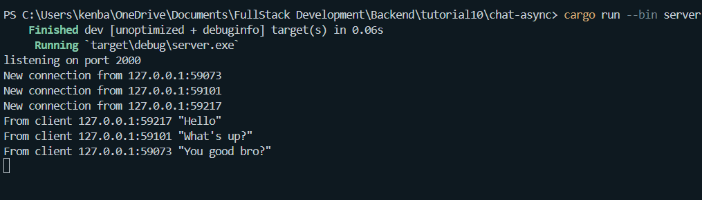
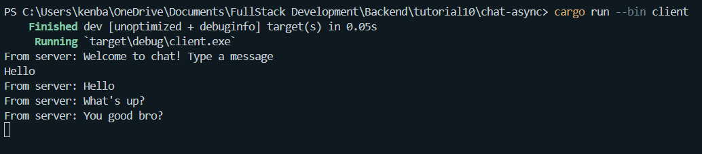
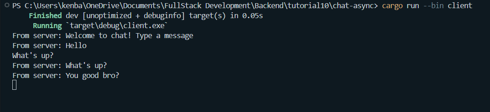
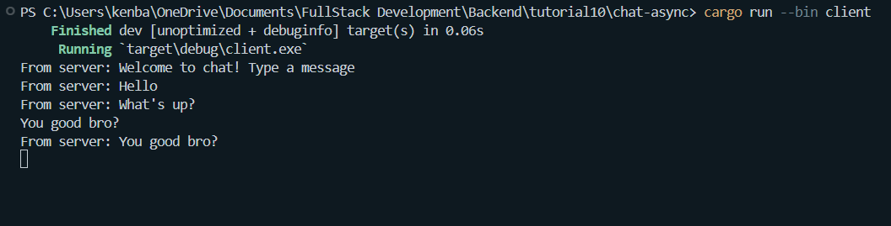
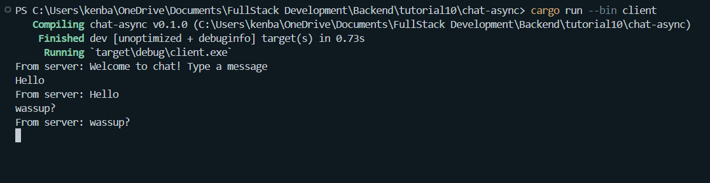
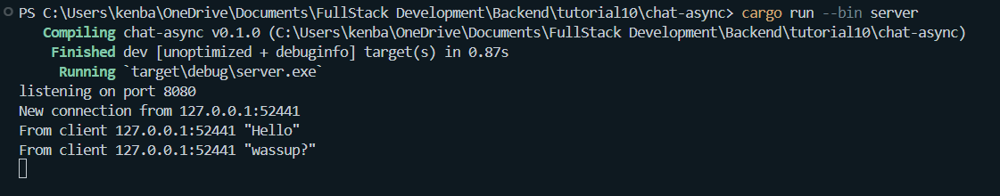
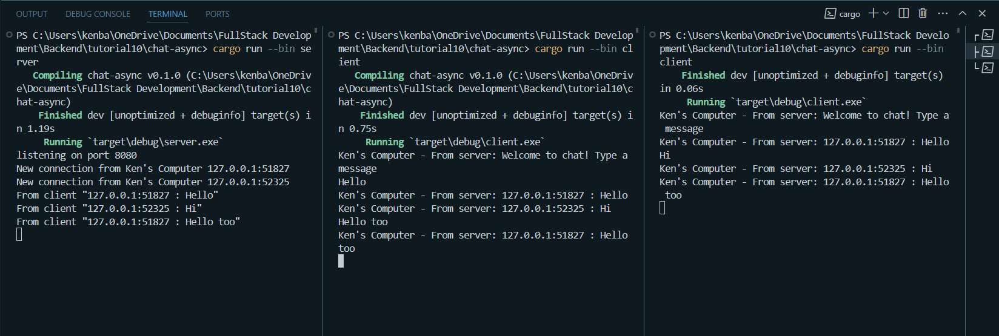

1. Terminal view from each client/server:
-   Server: 
-   Client 1: 
-   Client 2: 
-   Client 3: 
Explanation: Each time a client is ran using run cargo --bin client, it will search for a connection to port 2000 where the server is listening. If the server wasn't found, it crashed. So to run the program, always activate the server first with cargo run --bin server. Here is how the interactions work: the server is set up with a WebSocket-based chat application that uses a broadcast channel to manage messages between clients. When a client sends a message, the server receives it through its WebSocket connection and broadcasts it to all clients, including the sender, via the bcast_tx channel. Each client has an active listener for incoming messages (bcast_rx.recv()) in their concurrent loop, so when a message is broadcasted by the server, all connected clients receive and display it, resulting in the messages from each client being seen by all others.

2. 
-    client:
-    server: 
Explanation: changing the port to 8080 in both the client and server configurations would still use the WebSocket protocol. The use of the WebSocket protocol is defined in the Rust code by employing the tokio_websockets crate, which handles WebSocket connections regardless of the specific port used, as indicated by the use of ServerBuilder and ClientBuilder from the tokio_websockets crate for establishing WebSocket connections.

3.

Explanation: I added a description on the welcoming message on the server to tell that it's serving from Ken's computer. Besides that I also modified thet printing format on every client to also tell that it's running from Ken's computer. Lastly, I formatted the message send by the server to include the address of the client sending that message as follows:
let formatted_message = format!("{addr} : {text}");
println!("From client {formatted_message:?}");